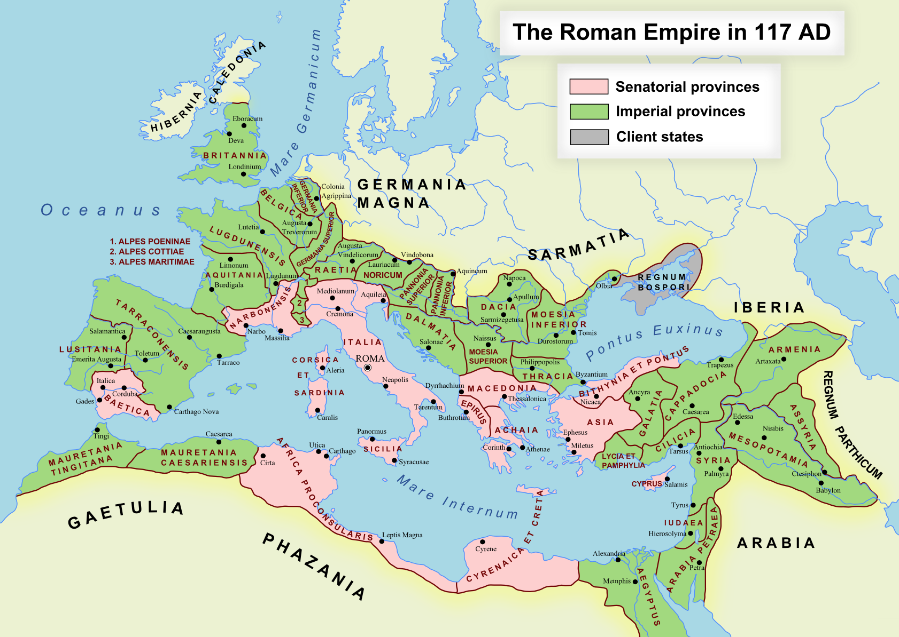

# [Nobel Literature Prize 1902] Theodor Mommsen

> the greatest living master of the art of historical writing, with special reference to his monumental work A History of Rome

> 当今最伟大的历史写作艺术大师，尤其是其巨作《罗马史》

## 罗马史

罗马帝国行省，公元 117 年

罗马帝国行省，公元 117 年

以下摘录来自《罗马史》第一卷第一、四、五、六、七章和第三卷第八、九、十、十一章，肖婷译。
